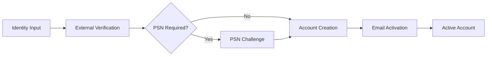
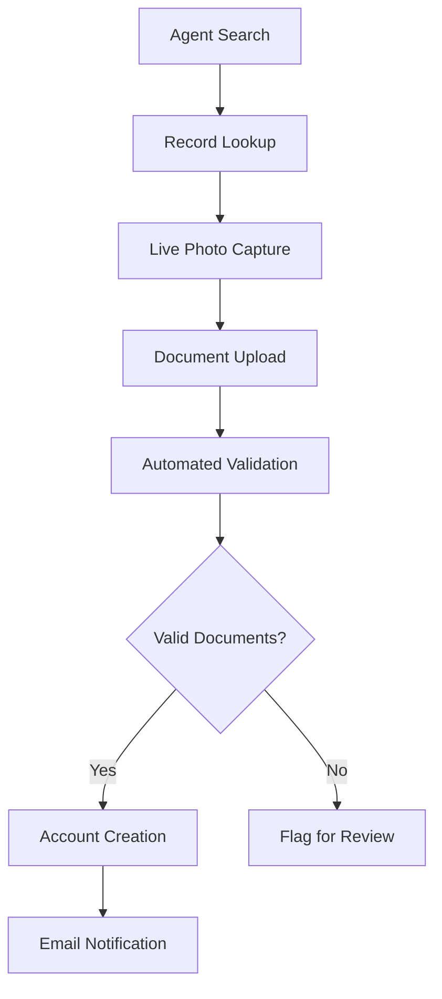
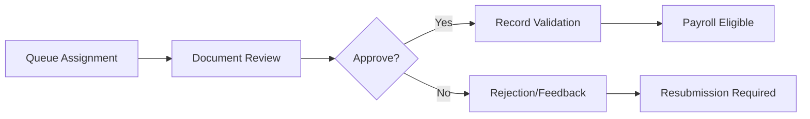

# BioVerify

A comprehensive, multi-tenant employee verification and lifecycle management system designed to eliminate ghost workers, ensure data integrity, and provide secure employee authentication services for government payrolls.

## About The Project

BioVerify is an enterprise-grade full-stack application built with **Spring Boot 3.5.3** backend and **Angular 19** frontend. It serves as a complete "System of Record and Verification" with integrated biometric capabilities, document management, and automated workflow processing.

The platform provides end-to-end employee lifecycle management from initial verification through ongoing proof-of-life monitoring, with robust security features including field-level encryption, JWT-based authentication, and comprehensive audit trails.

## Core Features

### 🔐 **Security & Authentication**
- **JWT-based Authentication** with refresh token mechanism
- **AES-256 Field-Level Encryption** for sensitive data (PII)
- **Role-Based Access Control (RBAC)** with 5 distinct user roles
- **Multi-Tenant Architecture** with complete data isolation
- **Account Activation Workflow** with email verification

### 👥 **User Roles & Capabilities**
- **Global Super Admin**: System-wide management and tenant oversight
- **Tenant Admin**: Complete tenant management, user creation, bulk operations
- **Reviewer**: Document review, record validation, queue management
- **Agent**: Proof of Life workflow execution with biometric capture
- **Self-Service User**: Personal dashboard with liveness check submissions

### 📄 **Document Management & Verification**
- **Proof of Life (PoL) Workflow**: Agent-assisted biometric verification
- **Document Upload & Validation**: Letter of Employment, Work ID, photos
- **PDF Document Viewer** with authentication-protected access
- **Invalid Document Queue** for flagged content review
- **OCR Integration** for automated document processing

### 🔄 **Advanced Workflows**
- **Bulk Verification Processing**: Asynchronous verification against external systems
- **Real-Time Job Monitoring**: Live status updates with polling mechanisms
- **Mismatch Resolution**: Side-by-side comparison for data discrepancy resolution
- **Payroll Export Generation**: Comprehensive CSV exports with audit trails
- **Liveness Check Scheduling**: Automated periodic verification requirements

### 📊 **Analytics & Reporting**
- **Role-Specific Dashboards** with real-time statistics
- **Queue Management** with advanced filtering and pagination
- **Export History Tracking** with download capabilities
- **Performance Metrics** and system monitoring
- **Audit Trail** for all critical operations

## 🛠️ Technology Stack

### Backend (Spring Boot 3.5.3)
- **Java 20** with Maven build system
- **Spring Security** with JWT authentication
- **Spring Data JPA** with PostgreSQL database
- **Spring Boot Actuator** for monitoring
- **Jasypt** for encryption services
- **Apache Commons CSV** for data processing
- **Apache POI** for Excel file handling
- **WebFlux** for reactive programming

### Frontend (Angular 19)
- **Angular Material** for UI components
- **RxJS** for reactive programming
- **ngx-webcam** for camera integration
- **ngx-extended-pdf-viewer** for document viewing
- **TypeScript 5.7** with modern ES features
- **Karma & Jasmine** for testing

### External Integrations
- **PostgreSQL** database with AES-256 encryption
- **Optima Identity Provider** for bulk verification
- **Email Notification Service** for account management
- **File Storage System** with configurable directories

## 🚀 Getting Started

### Prerequisites

- **Java 20+** with Maven 3.8+
- **Node.js 18+** with npm
- **PostgreSQL 14+** database
- **Angular CLI** (`npm install -g @angular/cli`)

### Environment Setup

1. **Clone the repository:**
```bash
git clone <your-repository-url>
cd bioverify
```

2. **Database Configuration:**
```bash
# Create PostgreSQL database
createdb bioverify

# Update connection in backend-java/bioverify/src/main/resources/application-local.properties
spring.datasource.url=jdbc:postgresql://localhost:5432/bioverify
spring.datasource.username=your_username
spring.datasource.password=your_password
```

3. **Backend Setup:**
```bash
cd backend-java/bioverify
mvn clean install
mvn spring-boot:run
```
Backend will be available at `http://localhost:8080`

4. **Frontend Setup:**
```bash
cd frontend-angular
npm install
ng serve
```
Frontend will be available at `http://localhost:4200`

### Configuration Files

#### Backend Configuration (`application.properties`)
- JWT token expiration and refresh settings
- Database connection parameters
- File storage directory paths
- Email service integration URLs
- Encryption keys and security settings

#### Frontend Configuration
- Backend API endpoints in proxy configuration
- Angular Material theme customization
- Build and development server settings

## 🏗️ System Architecture

### Project Structure
```
bioverify/
├── backend-java/bioverify/          # Spring Boot REST API
│   ├── src/main/java/com/proximaforte/bioverify/
│   │   ├── controller/              # REST endpoints
│   │   ├── service/                 # Business logic
│   │   ├── domain/                  # JPA entities
│   │   ├── repository/              # Data access layer
│   │   ├── dto/                     # Data transfer objects
│   │   ├── config/                  # Spring configuration
│   │   └── exception/               # Custom exceptions
│   └── src/main/resources/          # Configuration files
└── frontend-angular/                # Angular 19 SPA
    ├── src/app/
    │   ├── components/              # UI components
    │   ├── services/                # HTTP services
    │   ├── models/                  # TypeScript interfaces
    │   ├── dashboards/              # Role-based dashboards
    │   └── guards/                  # Route protection
    └── src/assets/                  # Static resources
```

## 🔄 Core Workflows

### 1. **Employee Registration & Verification**


### 2. **Proof of Life (PoL) Workflow**


### 3. **Review & Approval Process**


## 🗄️ Data Architecture

### Core Domain Entities

#### **MasterListRecord** (Central Entity)
```java
@Entity
public class MasterListRecord {
    // Identity Information (Encrypted)
    @Convert(converter = StringCryptoConverter.class)
    private String ssid, nin, bvn, psn;
    
    // Personal Details (Encrypted)
    @Convert(converter = StringCryptoConverter.class)
    private String firstName, lastName, email, phoneNumber;
    
    // Civil Service Information
    private String ministry, department, gradeLevel, cadre;
    
    // Workflow Status
    @Enumerated(EnumType.STRING)
    private RecordStatus status;
    
    // Proof of Life Data
    private String proofOfLifeAgentId;
    private String documentUrls;
    private LocalDateTime lastLivenessCheck;
    
    // Audit Fields
    private LocalDateTime createdAt, updatedAt;
    private String validatedByUserId;
}
```

#### **User Management**
```java
@Entity
public class User implements UserDetails {
    private String email, password;
    
    @Enumerated(EnumType.STRING)
    private Role role; // GLOBAL_SUPER_ADMIN, TENANT_ADMIN, REVIEWER, AGENT, SELF_SERVICE_USER
    
    @ManyToOne
    private Tenant tenant;
    
    // Reviewer-specific assignments
    @ManyToMany
    private Set<Ministry> assignedMinistries;
    
    private boolean isActive, isAccountActivated;
}
```

### Record Status Workflow
```
PENDING_VERIFICATION → AWAITING_REVIEW → REVIEWED → ACTIVE
                    ↓
                FLAGGED_NOT_IN_SOT
                FLAGGED_DATA_MISMATCH
                FLAGGED_INVALID_DOCUMENTS
                REJECTED
```

## 🔐 Security Implementation

### Authentication & Authorization
- **JWT Access Tokens** (24 hours) + **Refresh Tokens** (7 days)
- **Method-level Security** with `@PreAuthorize` annotations
- **Role-based Route Guards** in Angular frontend
- **CORS Configuration** for cross-origin requests

### Data Protection
- **AES-256 Field-Level Encryption** for PII using `@Convert(converter = StringCryptoConverter.class)`
- **SHA-256 Hashing** for searchable identifiers
- **BCrypt Password Encryption** for user credentials
- **Secure Headers** (HSTS, CSP, X-Frame-Options)

### Session Management
- **Stateless JWT Architecture**
- **Automatic Token Refresh** via HTTP interceptors
- **Secure Logout** with token invalidation
- **Account Activation** with time-limited tokens (30 minutes)

## 🎛️ API Endpoints

### Authentication (`/api/v1/auth`)
```http
POST /authenticate         # User login with JWT tokens
POST /refreshtoken        # Refresh access tokens
POST /logout              # User logout
POST /create-account      # Manual account creation
POST /activate-account    # Account activation via email
POST /resend-activation   # Resend activation email
```

### Records Management (`/api/v1/records`)
```http
POST /find-for-pol        # Find record for Proof of Life
GET  /queue/awaiting-review      # Get records awaiting review
GET  /queue/mismatched           # Get mismatched records
GET  /queue/invalid-documents    # Get invalid document records
PUT  /{recordId}                 # Update record data
POST /{recordId}/validate        # Validate record
POST /upload                     # Upload master list CSV
POST /bulk-verify               # Start bulk verification
POST /export                    # Generate payroll export
```

### Proof of Life (`/api/v1/pol`)
```http
POST /{recordId}/complete  # Complete PoL with documents (Agent only)
```

### User Management (`/api/v1/users`, `/api/v1/tenant-admin`)
```http
GET  /me/record           # Get current user's record
POST /                    # Create new users
GET  /reviewers          # Get reviewers with workload
PUT  /reviewers/{id}/assignments  # Update reviewer assignments
```

## 🖥️ User Interface Features

### **Dashboard Components by Role**

#### **Global Super Admin**
- System-wide performance overview
- Tenant management and creation
- Global statistics and monitoring

#### **Tenant Admin** 
- Comprehensive tenant dashboard with KPIs
- User creation and management interface
- Master list upload with progress tracking
- Bulk verification job monitoring
- Payroll export generation and history
- Review queue oversight

#### **Agent Interface**
- **Proof of Life Workflow Dashboard**
- Record search by SSID/NIN
- **Live webcam integration** for photo capture
- Document upload interface (Letter of Employment, Work ID)
- Real-time validation feedback

#### **Reviewer Interface**
- **Multi-tab Review Queues**:
  - Awaiting Review tab
  - Mismatched Data tab  
  - Invalid Documents tab
- **Document Review Dialog** with PDF viewer
- Advanced filtering (ministry, department, grade level)
- Side-by-side mismatch resolution interface

#### **Self-Service User**
- Personal profile dashboard
- **Liveness check interface** with webcam
- Countdown timer for next required check
- Account status monitoring

### **Advanced UI Features**
- **Real-time polling** for long-running operations
- **Progressive file upload** with status indicators
- **Responsive Angular Material** design
- **Authentication-protected PDF viewing**
- **Advanced filtering and pagination** for large datasets
- **Role-based navigation** and route protection

## 🔄 Business Workflows

### **1. Employee Onboarding Process**
```
Master List Upload → Identity Verification → Proof of Life → Document Review → Account Activation → Active Employee
```

### **2. Bulk Processing Workflow**
```
CSV Upload → Background Processing → External API Verification → Status Updates → Review Queue Distribution → Final Validation
```

### **3. Document Review Cycle**
```
Document Submission → Automated Validation → Queue Assignment → Human Review → Approval/Rejection → Account Creation/Feedback
```

### **4. Liveness Verification**
```
Scheduled Check → User Notification → Webcam Submission → Validation → Account Status Update → Next Schedule
```

## 🔧 Background Services

### **Asynchronous Job Processing**
- **BulkVerificationService**: Processes large datasets against external APIs
- **ExportService**: Generates comprehensive payroll reports
- **EmailService**: Handles account activation and notification workflows
- **LivenessCheckScheduler**: Automated periodic verification scheduling

### **External Integrations**
- **Optima Identity Provider**: Bulk verification with encrypted data exchange
- **Email Notification Service**: Template-based communication system
- **File Storage Service**: Secure document and media management

## 📊 Monitoring & Analytics

### **Real-time Dashboards**
- Record processing statistics by status
- User activity and workload distribution
- Job processing performance metrics
- Export history and download tracking

### **Audit & Compliance**
- Complete action audit trails
- Data access logging
- User session monitoring
- Security event tracking
